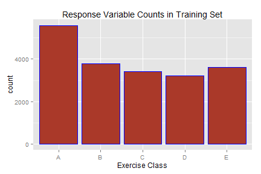
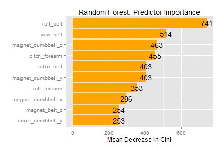

###predmachlearn-005
###September 2014
###Weightlifting Exercises Dataset

<br><br>

####Synopsis

The data for this project and the summary below comes from this source:<br>
 http://groupware.les.inf.puc-rio.br/har

This study involved six male participants with ages from 20-28 years and with little weightlifting experience.  These participants performed one set of 10 repetitions of the Unilateral Dumbbell Biceps Curl in five different manners.  The type of manner is listed under the variable name `classe` in the dataset:

 classe  | Description              
 :------:|----------------------------
 A       |exactly according to the specification 
 B       |throwing the elbows to the front      
 C       |lifting the dumbbell only halfway      
 D       |lowering the dumbbell only halfway     
 E       |throwing the hips to the front        


Class A corresponds to the correct execution of the exercise, while the other 4 classes correspond to common mistakes. Participants were supervised by an experienced weightlifter to make sure the execution complied to the manner they were supposed to simulate. The study authors made sure that all participants could easily simulate the mistakes in a safe and controlled manner by using a light dumbbell (1.25kg).

We successfully fitted a Random Forest model to this set of data.  From our cross-validation analysis, we estimate that the model can predict `classe` with an out-of-sample error of less than 1% (over 99% Accuracy).  The top three important variables in the model are `roll_belt`, `yaw_belt`, and `magnet_dumbbell_z`.

<br><br>

#### Part 1: Data Preparation

Read in PML training and testing datasets
and change values of "#DIV/0!" to "NA".


```r
knitr::opts_chunk$set(echo=TRUE, fig.width=6, fig.height=4)

pml_training <- read.csv('pml-training.csv',na.strings='#DIV/0!')
pml_testing <- read.csv('pml-testing.csv')
```

Correct the spelling in variable names.
Change "picth" to "pitch"


```r
names(pml_training) <- gsub('picth','pitch',names(pml_training))
names(pml_testing) <- gsub('picth','pitch',names(pml_testing))
```

Number of cases in the testing dataset


```r
nrow(pml_testing)
```

```
## [1] 20
```

Many variables in the testing & training datasets have values of all "NA" or nearly all "NA".
If a variable in the testing dataset has all 20 values equal to "NA", we'll exclude these variables from any further analysis

Get counts of "NA" for each column in testing dataset


```r
NA_counts_testing <- apply(pml_testing,2,function(x) length(which(is.na(x))))
```

Make list of variables that are all "NA" in the testing dataset


```r
variables_exclude <- names(NA_counts_testing[NA_counts_testing == 20])

length(variables_exclude)
```

```
## [1] 100
```

There are 100 variables in the testing dataset that are all "NA" and will be excluded from the analysis.  

Exclude these 100 
variables from analysis in the training and testing datasets.  
Also exclude the first 7 column variables from analysis since they are identifying labels .


```r
pml_training <- pml_training[,!(names(pml_training) %in% variables_exclude)]
pml_testing <- pml_testing[,!(names(pml_testing) %in% variables_exclude)]

pml_training <- pml_training[,-c(1:7)]
pml_testing <- pml_testing[,-c(1:7)]

ncol(pml_training)
```

```
## [1] 53
```

```r
ncol(pml_testing)
```

```
## [1] 53
```

Now there are 53 columns remaining from the original 160 columns.  52 columns will be used as predictor variables in the model.
The model will predict the response variable `classe` in the `pml_training` dataset.

<br><br><br>

#### Part 2: Model Selection

Plot the response variable `classe`


```r
library(ggplot2)

ggplot(data=pml_training,aes(x=classe))+geom_bar(color='blue',fill='#AA3929')+xlab('Exercise Class')+ggtitle('Response Variable Counts in Training Set')
```

 

Figure 1: Plot of the Reponse variable "classe"

<br><br>

The figure shows that category "A" has the most cases, but we should have enough cases for each category to fit a good model.

We decided to use a Random Forest as our model.

Reason: Random Forests are known to be very accurate, and we will be graded on how well we predict `classe` for the 20 test cases.  As long as we avoid overfitting, Random Forest models tend to perform very well for most scenarios.

Notes on Random Forests:<br>
http://127.0.0.1:27799/library/randomForest/html/randomForest.html

A drawback to Random Forests is the amount of computer time and memory needed for model fitting.  This excerpt from the notes saved a great deal of time in fitting the Random Forest model:<br>
"For large data sets, especially those with large number of variables, calling randomForest via the formula interface is not advised: There may be too much overhead in handling the formula."

<br><br><br>

#### Part 3: Model Fitting

Load `caret` library and set random seed.


```r
library(caret)
set.seed(9999)
```

Create an index to separate the `pml_training` dataset into about 60% as a 'training set' and about 40% as a 'testing set' for cross-validation.<br>
(percentages are based on class lecture notes)


```r
train_index = createDataPartition(pml_training$classe, p = 0.60,list=FALSE)

training_set = pml_training[train_index,]
testing_set = pml_training[-train_index,]

nrow(training_set)
```

```
## [1] 11776
```

```r
nrow(testing_set)
```

```
## [1] 7846
```

```r
nrow(training_set)/nrow(pml_training)
```

```
## [1] 0.6001
```

```r
nrow(testing_set)/nrow(pml_training)
```

```
## [1] 0.3999
```

Based on the row counts, the `pml_training` dataset was successfully split into about 60% for training and about 40% for testing.  We also have over 11,000 training cases for 52 predictor variables, so we should not have a problem with overfitting.

<br>

For relatively fast execution and reasonable memory usage, call the `randomForest` function without the "formula" interface.


```r
library(randomForest)
```

Fit a Random Forest to the 11,776 cases in the training set.


```r
model_RF <- randomForest(training_set[,1:52],training_set$classe)
```

Make predictions of `classe` for the 7,846 cases in the test dataset and produce the Confusion Matrix to determine accuracy of model fit.


```r
predictions <- predict(model_RF, testing_set)

conf_matrix <- confusionMatrix(predictions, testing_set$classe)
```

<br><br><br>

#### Part 4: Model Performance

Plot the Confusion Matrix table for the testing set:


```r
conf_matrix$table
```

```
##           Reference
## Prediction    A    B    C    D    E
##          A 2231    3    0    0    0
##          B    1 1512    9    0    0
##          C    0    3 1358   23    6
##          D    0    0    1 1260    4
##          E    0    0    0    3 1432
```

The table shows that the model predicts the testing set very well: the numbers along the diagonal are very large, while the off-diagonal numbers are either zero or much smaller than the diagonal numbers.

Since we are predicting a categorical variable `classe`, we will estimate the out-of-sample error using the Accuracy metrics from the Confusion Matrix. 


```r
conf_matrix$overall[c(1,3:4)]
```

```
##      Accuracy AccuracyLower AccuracyUpper 
##        0.9932        0.9912        0.9949
```

On our test set of 7,846 cases, the Accuracy is over 99%, even when we take into account the lower and upper bounds of the 95% Confidence Interval.

This Random Forest model is used for predicting `classe` for the 20 test cases:


```r
answers <- predict(model_RF, pml_testing)

answers
```

```
##  1  2  3  4  5  6  7  8  9 10 11 12 13 14 15 16 17 18 19 20 
##  B  A  B  A  A  E  D  B  A  A  B  C  B  A  E  E  A  B  B  B 
## Levels: A B C D E
```

<br>

Summarize the predictor variables in the model by decreasing order of importance.


```r
importance <- data.frame(importance(model_RF))

importance <- cbind.data.frame(row.names(importance),importance[,1])

names(importance) <- c("Variable","Mean_Decrease_Gini")

importance <- importance[order(importance[,2],decreasing=TRUE),]
```

Plot the top ten predictor variables from the Random Forest analysis in decreasing order of importance.


```r
qplot(x=importance[1:10,1],y=importance[1:10,2],importance,geom='bar',stat='identity',
      position='dodge',xlab='',ylab='Mean Decrease in Gini',
      main='Random Forest: Predictor Importance',fill=I('orange'))+coord_flip()+scale_x_discrete(limits=importance[10:1,1])+geom_text(aes(label = round(importance[1:10,2])),color='black')
```

 

Figure 2: Top ten predictors from the Random Forest Model in decreasing order of importance.

<br><br><br>

From the figure, we see that the top three important variables (in terms of reduced Gini error) are `roll_belt`, `yaw_belt`, and `magnet_dumbbell_z`.

<br><br><br>

#### Appendix: Function for writing predicted answers to text files for submission


```r
pml_write_files = function(x){
  n = length(x)
  for(i in 1:n){
    filename = paste0("problem_id_",i,".txt")
    write.table(x[i],file=filename,quote=FALSE,row.names=FALSE,col.names=FALSE)
  }
}

pml_write_files(answers)
```

